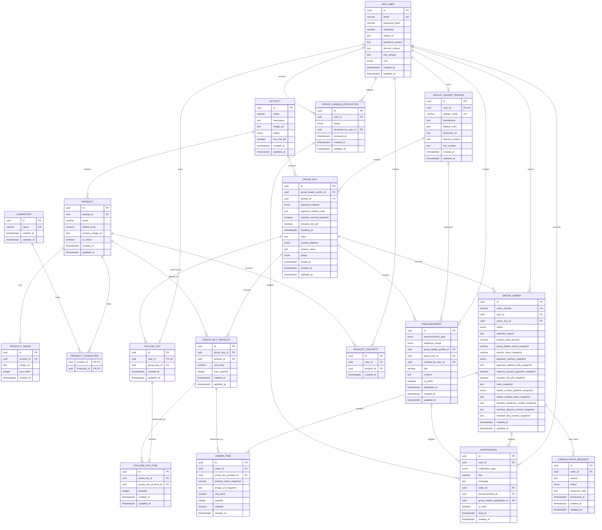

# 04_Database_Design_v2.1

**Project Name:** WuWaGroup  
**Document Type:** Database Design  
**Database:** PostgreSQL  
**ORM:** SQLAlchemy  
**Migration Tool:** Alembic  
**Version:** 2.1  
**Last Updated:** 2026-07-18  

---

# Change Log

| Version | Date | Description |
|---|---|---|
| 1.0 | Initial Draft | 建立初始資料庫設計 |
| 1.1 | Previous Version | 完成會員、活動、商品、開團、跟團清單、訂單、公告與通知資料模型 |
| 1.2 | Previous Version | 新增團主申請、會員外部聯絡方式、訂單聯絡快照、特定開團公告及訂單拒絕原因 |
| 2.0 | 2026-07-18 | 配合 React 版本重新整理資料庫，補充完整狀態限制、交易鎖定與歷史快照規則 |
| 2.1 | 2026-07-18 | 配合前三份 v2.1 文件，移除帳號與團主停用資料、簡化團主申請、調整活動、付款方式、開團編輯、訂單排序、取消申請及公告資料模型 |

---

# Table of Contents

1. Document Purpose  
2. Database Overview  
3. Design Principles  
4. Naming Convention  
5. Enum Definitions  
6. Table Definitions  
   - 6.1 App User  
   - 6.2 Group Leader Application  
   - 6.3 Group Leader Profile  
   - 6.4 Activity  
   - 6.5 Product  
   - 6.6 Product Image  
   - 6.7 Character  
   - 6.8 Product Character  
   - 6.9 Group Buy  
   - 6.10 Group Buy Product  
   - 6.11 Follow List  
   - 6.12 Follow List Item  
   - 6.13 Group Order  
   - 6.14 Order Item  
   - 6.15 Cancellation Request  
   - 6.16 Product Favorite  
   - 6.17 Announcement  
   - 6.18 Notification  
7. Relationship Rules  
8. Transaction Design  
9. Index Design  
10. Constraint Summary  
11. Delete and Retention Strategy  
12. Complete Table Overview  
13. Complete ERD  
14. Future Expansion  
15. Final Design Decisions  

---

# 1. Document Purpose

本文件定義 WuWaGroup 第一版使用的 PostgreSQL 資料庫結構。

本文件用途：

- 作為 PostgreSQL Schema 建立依據
- 作為 SQLAlchemy Model 建立依據
- 作為 Alembic Migration 建立依據
- 作為 Pydantic Schema 設計依據
- 作為 API Design 的資料來源
- 定義資料表欄位與關聯
- 定義 Primary Key、Foreign Key、Unique Constraint 與 Check Constraint
- 定義索引
- 定義 Transaction 與 Row Lock
- 定義資料保留及刪除策略
- 確保 Project Specification、User Flow 與 UI Specification 使用一致資料模型

本文件以可完成的個人作品為前提。

不加入第一版沒有實際用途的企業級資料表。

---

# 2. Database Overview

## 2.1 Technology

```text
Database：PostgreSQL
ORM：SQLAlchemy
Migration：Alembic
Validation：Pydantic
```

---

## 2.2 Primary Key

主要資料表統一使用：

```text
UUID
```

UUID 可由 Python 產生：

```python
uuid.uuid4()
```

或由 PostgreSQL 產生：

```sql
gen_random_uuid()
```

若使用 `gen_random_uuid()`，需啟用：

```sql
CREATE EXTENSION IF NOT EXISTS pgcrypto;
```

---

## 2.3 Datetime

時間欄位統一使用：

```text
TIMESTAMPTZ
```

資料庫保存：

```text
UTC
```

前端顯示時轉換為：

```text
Asia/Taipei
```

---

## 2.4 Character Encoding

使用：

```text
UTF-8
```

需支援：

- 中文
- 英文
- 日文
- 特殊符號
- 商品名稱
- 角色名稱
- 團主名稱
- 團規
- 公告內容

---

## 2.5 Money

所有金額使用：

```text
NUMERIC(12,2)
```

不使用：

```text
FLOAT
DOUBLE PRECISION
```

避免浮點數誤差。

---

## 2.6 Boolean

Boolean 欄位使用：

```text
BOOLEAN
```

例如：

```text
is_active
is_public
is_read
has_full_gift
includes_full_gift
requires_second_payment
```

---

## 2.7 React Impact

React 不直接改變資料庫結構。

React 只透過 FastAPI API 讀取及修改資料。

資料庫不保存：

- React Component 狀態
- Modal 狀態
- Loading 狀態
- Route 狀態
- AuthContext 狀態
- sessionStorage Token

---

# 3. Design Principles

## 3.1 Personal Project Scope

優先考量：

- 結構清楚
- 關聯明確
- 容易實作
- 容易測試
- 容易說明
- 可展示關聯式資料庫能力
- 可展示 Transaction
- 可展示 Row Lock
- 可展示資料快照

不加入目前沒有使用需求的企業級資料表。

---

## 3.2 Normalization

正式業務資料以關聯及 Foreign Key 為主。

例如：

```text
group_leader_profile_id
activity_id
product_id
group_buy_id
```

不直接重複保存名稱。

例外為：

```text
歷史訂單快照
通知訊息快照
```

---

## 3.3 Historical Snapshot

訂單建立後，即使以下資料被修改：

- 商品名稱
- 商品圖片
- 商品價格
- 團主名稱
- 活動名稱
- 團規
- 付款方式
- 聯絡方式

歷史訂單仍需維持下單時內容。

因此訂單及訂單明細保存必要快照。

---

## 3.4 Calculated Data

以下資料不直接保存：

```text
remaining_quantity
occupied_quantity
available_quantity
sold_quantity
group_buy_count
completed_order_count
notification_recipient_count
```

由現有資料即時計算。

---

## 3.5 Status and Controlled Delete

重要業務資料通常使用狀態或限制刪除，以保留歷史紀錄。

例如：

```text
activity.status = ended
product.is_active = false
group_buy.status = closed
```

以下資料可依明確規則刪除：

- 尚未成為歷史訂單一部分的暫存資料
- 商品收藏
- 沒有商品關聯的角色
- 團主與平台公告
- 公告刪除時，由該公告建立的通知

帳號及團主資格第一版不提供停用或刪除功能。

## 3.6 Server-Side Validation

資料庫 Constraint 無法涵蓋所有跨資料表規則。

以下規則由 Service Layer 再次驗證：

- 使用者權限
- 團主資格是否存在
- 團主公開資料是否完成
- 開團所屬團主
- 商品所屬活動
- 活動是否支援滿贈
- `other` 付款方式是否提供說明
- 開團是否已有正式訂單
- 開團商品集合與價格是否仍可修改
- 商品數量上限是否低於目前占用數量
- 訂單狀態轉換
- 訂單拒絕原因
- 同一訂單是否已有待處理取消申請
- 公告所屬團主與公告範圍
- 公告通知對象
- 公告無通知對象時是否允許發布
- 管理員不得審核自己不存在或已完成的申請

# 4. Naming Convention

## 4.1 Table Names

資料表使用：

```text
snake_case
單數名詞
```

例如：

```text
app_user
activity
product
group_buy
group_order
announcement
notification
```

---

## 4.2 App User Table

使用：

```text
app_user
```

不使用：

```text
user
```

避免與 PostgreSQL `USER` 特殊語意混淆。

---

## 4.3 Order Table

使用：

```text
group_order
```

不使用：

```text
order
```

避免與 SQL `ORDER BY` 關鍵字混淆。

---

## 4.4 Column Names

欄位使用：

```text
snake_case
```

例如：

```text
created_at
updated_at
group_buy_id
product_total_amount
audience_scope
```

---

## 4.5 Primary Key

主要資料表統一使用：

```text
id
```

---

## 4.6 Foreign Key

格式：

```text
<entity>_id
```

例如：

```text
user_id
activity_id
product_id
group_buy_id
order_id
```

雖然資料表名稱是 `app_user`，其他資料表仍使用：

```text
user_id
```

---

## 4.7 Timestamp

一般時間：

```text
created_at
updated_at
```

特定事件：

```text
reviewed_at
published_at
processed_at
closed_at
read_at
deadline_at
```

---

# 5. Enum Definitions

## 5.1 UserRole

```text
member
admin
```

| Value | Description |
|---|---|
| member | 一般會員 |
| admin | 管理員 |

團主不是獨立 UserRole。

團主資格由：

```text
group_leader_profile
```

判斷。

---

## 5.2 GroupLeaderApplicationStatus

```text
pending
approved
rejected
```

| Value | Description |
|---|---|
| pending | 等待管理員審核 |
| approved | 申請已通過 |
| rejected | 申請已拒絕 |

---

## 5.3 ActivityStatus

```text
open
ended
```

| Value | Description |
|---|---|
| open | 目前活動，顯示於首頁目前活動區 |
| ended | 已結束活動，顯示於首頁已結束活動區 |

活動名稱由管理員自由建立，不使用固定活動分類 Enum。

---

## 5.4 GroupBuyStatus

```text
open
closed
```

| Value | Description |
|---|---|
| open | 開團狀態為開放 |
| closed | 團主已提前結單 |

截止時間已到屬於計算後的不可下單狀態，不另外保存 Enum。

第一版不加入：

```text
draft
```

---

## 5.5 PaymentMethod

```text
bank_transfer
cash_on_delivery
other
```

| Value | Description |
|---|---|
| bank_transfer | 銀行匯款 |
| cash_on_delivery | 貨到付款或取貨付款 |
| other | 其他付款方式，需另外填寫說明 |

一筆開團只能使用一種付款方式。

---

## 5.6 ContactPlatform

```text
facebook
discord
line
```

| Value | Description |
|---|---|
| facebook | Facebook |
| discord | Discord |
| line | LINE |

一筆開團只保存一項主要聯絡方式。

會員及團主資料可保存多項聯絡方式。

---

## 5.7 OrderStatus

```text
pending_confirmation
pending_payment
paid
shipped
completed
cancelled
rejected
```

| Value | Description |
|---|---|
| pending_confirmation | 等待團主確認 |
| pending_payment | 已接受，等待付款 |
| paid | 團主已確認付款 |
| shipped | 已寄出或已通知取貨 |
| completed | 訂單已完成 |
| cancelled | 取消申請已通過 |
| rejected | 團主拒絕接受訂單 |

---

## 5.8 CancellationStatus

```text
pending
approved
rejected
```

| Value | Description |
|---|---|
| pending | 等待團主處理 |
| approved | 團主同意取消 |
| rejected | 團主拒絕取消 |

---

## 5.9 AnnouncementType

```text
platform
group_leader
```

| Value | Description |
|---|---|
| platform | 管理員發布的平台公告 |
| group_leader | 團主發布的團務公告 |

---

## 5.10 AnnouncementAudienceScope

```text
leader_unfinished
group_buy_unfinished
```

| Value | Description |
|---|---|
| leader_unfinished | 該團主所有仍有未完成訂單的會員 |
| group_buy_unfinished | 指定開團中仍有未完成訂單的會員 |

此 Enum 只用於團主公告；平台公告不使用。

---

## 5.11 NotificationType

```text
system
group_leader
```

| Value | Description |
|---|---|
| system | 訂單、申請結果或平台公告通知 |
| group_leader | 團主公告通知 |

---

# 6. Table Definitions

第一版共使用：

```text
18 張資料表
```

---

# 6.1 App User Table

Table Name：

```text
app_user
```

用途：

儲存會員及管理員帳號與私人聯絡方式。

團主仍使用同一筆帳號登入。

---

## Columns

| Column | Type | Nullable | Default | Description |
|---|---|---:|---|---|
| id | UUID | No | uuid4 | Primary Key |
| email | VARCHAR(255) | No | — | 登入 Email |
| password_hash | VARCHAR(255) | No | — | 雜湊後密碼 |
| nickname | VARCHAR(50) | No | — | 會員顯示名稱 |
| avatar_url | TEXT | Yes | NULL | 會員頭像 URL，未提供時由前端顯示預設頭像 |
| facebook_contact | TEXT | Yes | NULL | Facebook 私人聯絡資料 |
| discord_contact | TEXT | Yes | NULL | Discord 私人聯絡資料 |
| line_contact | TEXT | Yes | NULL | LINE 私人聯絡資料 |
| role | UserRole | No | member | 會員或管理員 |
| created_at | TIMESTAMPTZ | No | now() | 帳號建立時間 |
| updated_at | TIMESTAMPTZ | No | now() | 最後更新時間 |

---

## Constraints

```sql
PRIMARY KEY (id)

CHECK (LENGTH(TRIM(nickname)) > 0)
```

Email 使用大小寫不敏感唯一索引：

```sql
CREATE UNIQUE INDEX uq_app_user_email_lower
ON app_user (LOWER(email));
```

不再另外建立：

```text
UNIQUE (email)
```

避免重複索引。

---

## Contact Constraint

```sql
CHECK (
    facebook_contact IS NOT NULL
    OR discord_contact IS NOT NULL
    OR line_contact IS NOT NULL
)
```

空字串需由後端正規化為：

```text
NULL
```

---

## Contact Privacy

會員聯絡方式：

- 不公開
- 不顯示於團主公開頁
- 只有會員本人可管理
- 團主只能從自己訂單的聯絡快照查看
- 管理員可於必要後台操作查看

---

## Group Leader Avatar

團主公開頁的頭像來源使用：

```text
app_user.avatar_url
```

不在 `group_leader_profile` 重複保存頭像。

---

## Notes

不加入：

```text
is_group_leader
```

團主資格由是否存在 `group_leader_profile` 判斷。

# 6.2 Group Leader Application Table

Table Name：

```text
group_leader_application
```

用途：

儲存會員申請成為團主的狀態及管理員審核結果。

第一版申請不要求申請說明、團主名稱、公開聯絡方式或審核備註。

---

## Columns

| Column | Type | Nullable | Default | Description |
|---|---|---:|---|---|
| id | UUID | No | uuid4 | Primary Key |
| user_id | UUID | No | — | 提出申請的會員 |
| status | GroupLeaderApplicationStatus | No | pending | 申請狀態 |
| reviewed_by_user_id | UUID | Yes | NULL | 審核管理員 |
| reviewed_at | TIMESTAMPTZ | Yes | NULL | 審核時間 |
| created_at | TIMESTAMPTZ | No | now() | 申請時間 |
| updated_at | TIMESTAMPTZ | No | now() | 更新時間 |

---

## Constraints

```sql
PRIMARY KEY (id)

FOREIGN KEY (user_id)
REFERENCES app_user(id)
ON DELETE RESTRICT

FOREIGN KEY (reviewed_by_user_id)
REFERENCES app_user(id)
ON DELETE RESTRICT
```

---

## Review State Constraint

```sql
CHECK (
    (
        status = 'pending'
        AND reviewed_by_user_id IS NULL
        AND reviewed_at IS NULL
    )
    OR
    (
        status IN ('approved', 'rejected')
        AND reviewed_by_user_id IS NOT NULL
        AND reviewed_at IS NOT NULL
    )
)
```

---

## One Pending Application

同一會員只能同時存在一筆待審核申請：

```sql
CREATE UNIQUE INDEX uq_group_leader_application_pending_user
ON group_leader_application (user_id)
WHERE status = 'pending';
```

歷史申請仍可保留多筆。

申請被拒絕後，只要目前沒有待審核申請，即可再次申請。

已存在 `group_leader_profile` 的會員不可再次申請，此規則由 Service Layer 驗證。

---

## Approval Result

申請通過時：

- 將申請改為 `approved`
- 建立一筆尚未完成公開資料的 `group_leader_profile`
- 建立通知

不從會員私人資料自動複製團主公開名稱或聯絡方式。

# 6.3 Group Leader Profile Table

Table Name：

```text
group_leader_profile
```

用途：

儲存已通過審核會員的團主公開資料。

一名使用者最多只有一筆團主資料。

申請剛通過時可以先建立不完整資料，之後由團主自行完成公開名稱及聯絡方式。

---

## Columns

| Column | Type | Nullable | Default | Description |
|---|---|---:|---|---|
| id | UUID | No | uuid4 | Primary Key |
| user_id | UUID | No | — | 對應會員帳號 |
| display_name | VARCHAR(50) | Yes | NULL | 團主公開名稱 |
| introduction | TEXT | Yes | NULL | 團主自我介紹 |
| default_rules | TEXT | Yes | NULL | 建立開團時的預設團規，也顯示於團主公開頁 |
| facebook_url | TEXT | Yes | NULL | 公開 Facebook 聯絡資料 |
| discord_contact | TEXT | Yes | NULL | 公開 Discord 聯絡資料 |
| line_contact | TEXT | Yes | NULL | 公開 LINE 聯絡資料 |
| created_at | TIMESTAMPTZ | No | now() | 成為團主時間 |
| updated_at | TIMESTAMPTZ | No | now() | 更新時間 |

---

## Constraints

```sql
PRIMARY KEY (id)

FOREIGN KEY (user_id)
REFERENCES app_user(id)
ON DELETE RESTRICT

UNIQUE (user_id)
```

團主名稱使用大小寫不敏感的條件式唯一索引：

```sql
CREATE UNIQUE INDEX uq_group_leader_display_name_lower
ON group_leader_profile (LOWER(display_name))
WHERE display_name IS NOT NULL;
```

空字串由後端正規化為 `NULL`。

---

## Profile Readiness

以下條件全部成立時，團主公開資料才視為完成：

```text
display_name IS NOT NULL
AND
至少一項公開聯絡方式不為 NULL
```

公開資料未完成時：

- 可進入團主資料設定頁
- 不公開團主頁
- 不可建立開團
- 不可發布團主公告

此為跨欄位及權限規則，由 Service Layer 驗證。

會員私人聯絡方式不會自動複製到本表。

---

## Statistics

以下公開統計不保存於此表：

```text
group_buy_count
completed_order_count
```

由 `group_buy` 與 `group_order` 計算。

# 6.4 Activity Table

Table Name：

```text
activity
```

用途：

儲存每一個實際官方活動，例如：

```text
3.4 官方周邊
Solar5 主題周邊
潮聲信籤
墜夢奇境
予世新生
```

活動不是固定分類。管理員每新增一筆活動，首頁便新增對應活動卡片。

---

## Columns

| Column | Type | Nullable | Default | Description |
|---|---|---:|---|---|
| id | UUID | No | uuid4 | Primary Key |
| name | VARCHAR(150) | No | — | 活動名稱 |
| description | TEXT | Yes | NULL | 活動說明 |
| image_url | TEXT | No | — | 活動主要圖片 |
| status | ActivityStatus | No | open | 目前活動或已結束活動 |
| has_full_gift | BOOLEAN | No | false | 是否支援滿贈 |
| created_at | TIMESTAMPTZ | No | now() | 建立時間 |
| updated_at | TIMESTAMPTZ | No | now() | 更新時間 |

---

## Constraints

```sql
PRIMARY KEY (id)

CHECK (LENGTH(TRIM(name)) > 0)

CHECK (LENGTH(TRIM(image_url)) > 0)
```

活動名稱不設定全域 Unique。

不同時期的活動可能使用相似名稱。

---

## Status Rule

活動結束：

```text
status = ended
```

仍可：

- 瀏覽活動
- 瀏覽商品
- 查看歷史開團
- 查看歷史訂單

不可：

- 建立新開團

---

## Homepage Grouping and Sorting

首頁依狀態分成：

```text
open  → 目前活動
ended → 已結束活動
```

各區內排序：

```text
created_at DESC
```

第一版不加入活動開始及結束日期欄位。

# 6.5 Product Table

Table Name：

```text
product
```

用途：

儲存官方活動中的商品。

一項商品可以關聯多名角色，但仍只有一筆商品資料。

---

## Columns

| Column | Type | Nullable | Default | Description |
|---|---|---:|---|---|
| id | UUID | No | uuid4 | Primary Key |
| activity_id | UUID | No | — | 所屬活動 |
| name | VARCHAR(150) | No | — | 商品名稱 |
| official_price | NUMERIC(12,2) | Yes | NULL | 官方商品價格，固定以 TWD 保存與顯示 |
| primary_image_url | TEXT | No | — | 商品主要圖片 |
| is_active | BOOLEAN | No | true | 是否上架 |
| created_at | TIMESTAMPTZ | No | now() | 建立時間 |
| updated_at | TIMESTAMPTZ | No | now() | 更新時間 |

---

## Constraints

```sql
PRIMARY KEY (id)

FOREIGN KEY (activity_id)
REFERENCES activity(id)
ON DELETE RESTRICT

UNIQUE (activity_id, name)

CHECK (LENGTH(TRIM(name)) > 0)

CHECK (LENGTH(TRIM(primary_image_url)) > 0)

CHECK (
    official_price IS NULL
    OR official_price >= 0
)
```

同一活動不能建立兩筆完全同名商品。

不同款式應在名稱中明確區分，例如 A 款、B 款。

---

## Character Input

角色仍使用獨立的共用 `character` 資料表，但不提供獨立角色管理頁。

管理員在商品表單輸入部分角色名稱時：

- 搜尋既有角色
- 選擇搜尋結果
- 查無結果時明確建立新角色
- 可為同一商品選擇多名角色

---

## Inactive Product

```text
is_active = false
```

代表：

- 不顯示於一般活動商品列表
- 不可加入新開團
- 歷史開團及訂單仍保留

商品可由管理員重新上架。

# 6.6 Product Image Table

Table Name：

```text
product_image
```

用途：

儲存商品主要圖片以外的額外官方圖片。

---

## Columns

| Column | Type | Nullable | Default | Description |
|---|---|---:|---|---|
| id | UUID | No | uuid4 | Primary Key |
| product_id | UUID | No | — | 所屬商品 |
| image_url | TEXT | No | — | 圖片 URL |
| sort_order | INTEGER | No | 0 | 圖片排序 |
| created_at | TIMESTAMPTZ | No | now() | 建立時間 |

---

## Constraints

```sql
PRIMARY KEY (id)

FOREIGN KEY (product_id)
REFERENCES product(id)
ON DELETE CASCADE

UNIQUE (product_id, sort_order)

CHECK (sort_order >= 0)

CHECK (LENGTH(TRIM(image_url)) > 0)
```

數字越小越先顯示。

---

# 6.7 Character Table

Table Name：

```text
character
```

用途：

儲存可跨活動共用的角色名稱，供商品關聯、輸入搜尋及全站搜尋。

---

## Columns

| Column | Type | Nullable | Default | Description |
|---|---|---:|---|---|
| id | UUID | No | uuid4 | Primary Key |
| name | VARCHAR(100) | No | — | 角色名稱 |
| created_at | TIMESTAMPTZ | No | now() | 建立時間 |
| updated_at | TIMESTAMPTZ | No | now() | 更新時間 |

---

## Constraints

```sql
PRIMARY KEY (id)

CHECK (LENGTH(TRIM(name)) > 0)
```

使用大小寫不敏感唯一索引：

```sql
CREATE UNIQUE INDEX uq_character_name_lower
ON character (LOWER(name));
```

後端需先 Trim，避免只有前後空白差異的重複角色。

---

## Scope

第一版只保存角色名稱。

不保存：

- 角色圖片
- 屬性
- 武器
- 稀有度
- 生日
- 角色介紹

---

## Maintenance and Delete Rule

角色主要於商品表單中搜尋或新增。

名稱輸入錯誤時，可透過精簡維護功能修改。

角色沒有商品關聯時可以刪除。

角色已有商品關聯時：

```text
不可刪除
```

需先移除所有 `product_character` 關聯。

# 6.8 Product Character Table

Table Name：

```text
product_character
```

用途：

建立商品與角色的多對多關聯。

---

## Columns

| Column | Type | Nullable | Default | Description |
|---|---|---:|---|---|
| product_id | UUID | No | — | 商品 ID |
| character_id | UUID | No | — | 角色 ID |

---

## Constraints

```sql
PRIMARY KEY (product_id, character_id)

FOREIGN KEY (product_id)
REFERENCES product(id)
ON DELETE CASCADE

FOREIGN KEY (character_id)
REFERENCES character(id)
ON DELETE RESTRICT
```

`character_id` 使用 `RESTRICT`，確保已有商品關聯的角色不會被直接刪除。

---

## Design Rule

此表只代表：

```text
商品與角色相關
```

不代表：

- 商品款式
- 角色選項
- 不同價格
- 不同庫存
- 不同訂購規格

---

# 6.9 Group Buy Table

Table Name：

```text
group_buy
```

用途：

儲存團主針對單一活動建立的一次開團。

---

## Columns

| Column | Type | Nullable | Default | Description |
|---|---|---:|---|---|
| id | UUID | No | uuid4 | Primary Key |
| group_leader_profile_id | UUID | No | — | 建立開團的團主 |
| activity_id | UUID | No | — | 所屬活動 |
| payment_method | PaymentMethod | No | — | 付款方式 |
| payment_method_note | TEXT | Yes | NULL | 選擇 `other` 時的付款方式說明 |
| requires_second_payment | BOOLEAN | No | false | 是否需要二補 |
| includes_full_gift | BOOLEAN | No | false | 是否包含滿贈 |
| deadline_at | TIMESTAMPTZ | No | — | 收單截止時間 |
| rules | TEXT | No | — | 本次完整團規 |
| contact_platform | ContactPlatform | No | — | 主要聯絡平台 |
| contact_value | TEXT | No | — | 主要聯絡內容 |
| status | GroupBuyStatus | No | open | 開團狀態 |
| closed_at | TIMESTAMPTZ | Yes | NULL | 提前結單時間 |
| created_at | TIMESTAMPTZ | No | now() | 建立時間 |
| updated_at | TIMESTAMPTZ | No | now() | 更新時間 |

---

## Constraints

```sql
PRIMARY KEY (id)

FOREIGN KEY (group_leader_profile_id)
REFERENCES group_leader_profile(id)
ON DELETE RESTRICT

FOREIGN KEY (activity_id)
REFERENCES activity(id)
ON DELETE RESTRICT

CHECK (deadline_at > created_at)

CHECK (LENGTH(TRIM(rules)) > 0)

CHECK (LENGTH(TRIM(contact_value)) > 0)

CHECK (
    (
        payment_method = 'other'
        AND payment_method_note IS NOT NULL
        AND LENGTH(TRIM(payment_method_note)) > 0
    )
    OR
    (
        payment_method <> 'other'
        AND payment_method_note IS NULL
    )
)
```

---

## Status Constraint

```sql
CHECK (
    (
        status = 'open'
        AND closed_at IS NULL
    )
    OR
    (
        status = 'closed'
        AND closed_at IS NOT NULL
    )
)
```

---

## Creation Requirements

建立開團時需確認：

```text
團主公開資料已完成
activity.status = open
deadline_at > current_time
至少選擇一項 active 商品
```

---

## Effective Availability

可接受新的跟團清單或訂單時，必須同時符合：

```text
group_buy.status = open
AND group_buy.deadline_at > current_time
AND activity.status = open
AND 團主公開資料已完成
```

---

## Full Gift Rule

若：

```text
activity.has_full_gift = false
```

則：

```text
group_buy.includes_full_gift = false
```

此為跨資料表規則，由 Service Layer 驗證。

---

## Editable Fields

### 尚未存在任何正式訂單

可修改：

- 付款方式及其他付款說明
- 二補設定
- 滿贈設定
- 收單期限
- 團規
- 主要聯絡方式
- 開團商品集合
- 開團商品價格
- 商品數量上限

仍不可修改：

- 建立團主
- 所屬活動
- 建立時間

### 已存在至少一筆正式訂單

只可修改：

- `deadline_at`
- `contact_platform`
- `contact_value`
- `group_buy_product.max_quantity`

不可修改：

- 付款方式
- 其他付款說明
- 二補設定
- 滿贈設定
- 團規
- 商品集合
- 商品價格

數量上限仍須符合不低於目前占用數量。

# 6.10 Group Buy Product Table

Table Name：

```text
group_buy_product
```

用途：

儲存開團中的商品、售價及接單數量上限。

---

## Columns

| Column | Type | Nullable | Default | Description |
|---|---|---:|---|---|
| id | UUID | No | uuid4 | Primary Key |
| group_buy_id | UUID | No | — | 所屬開團 |
| product_id | UUID | No | — | 官方商品 |
| unit_price | NUMERIC(12,2) | No | — | 團主售價，固定為 TWD |
| max_quantity | INTEGER | No | — | 接單總數量上限 |
| created_at | TIMESTAMPTZ | No | now() | 建立時間 |
| updated_at | TIMESTAMPTZ | No | now() | 更新時間 |

---

## Constraints

```sql
PRIMARY KEY (id)

FOREIGN KEY (group_buy_id)
REFERENCES group_buy(id)
ON DELETE RESTRICT

FOREIGN KEY (product_id)
REFERENCES product(id)
ON DELETE RESTRICT

UNIQUE (group_buy_id, product_id)

CHECK (unit_price >= 0)

CHECK (max_quantity > 0)
```

---

## Same Activity Rule

必須符合：

```text
product.activity_id = group_buy.activity_id
```

由 Service Layer 驗證。

---

## Active Product Rule

建立時必須符合：

```text
product.is_active = true
```

---

## Occupied Quantity

由有效訂單明細計算：

```sql
SELECT COALESCE(SUM(oi.quantity), 0)
FROM order_item AS oi
JOIN group_order AS go
    ON go.id = oi.order_id
WHERE oi.group_buy_product_id = :group_buy_product_id
  AND go.status NOT IN ('cancelled', 'rejected');
```

---

## Available Quantity

```text
available_quantity
=
max_quantity
-
occupied_quantity
```

不保存：

```text
remaining_quantity
occupied_quantity
available_quantity
sold_quantity
```

---

## Quantity Update Rule

修改上限時：

```text
new_max_quantity >= occupied_quantity
```

否則拒絕修改。

官方後續限制可能改變，因此即使已有訂單，仍允許在安全範圍內調整上限。

---

## Product Set Edit Rule

開團沒有任何正式訂單時，可以新增或移除 `group_buy_product`。

移除時必須確認：

- 開團仍至少保留一項商品
- 該項目沒有 `follow_list_item`
- 該項目沒有 `order_item`

開團已有正式訂單後，商品集合及 `unit_price` 完全凍結。

# 6.11 Follow List Table

Table Name：

```text
follow_list
```

用途：

儲存會員尚未正式送出的跟團清單。

一名會員同時最多只有一張跟團清單。

---

## Columns

| Column | Type | Nullable | Default | Description |
|---|---|---:|---|---|
| id | UUID | No | uuid4 | Primary Key |
| user_id | UUID | No | — | 清單擁有者 |
| group_buy_id | UUID | No | — | 清單所屬開團 |
| created_at | TIMESTAMPTZ | No | now() | 建立時間 |
| updated_at | TIMESTAMPTZ | No | now() | 更新時間 |

---

## Constraints

```sql
PRIMARY KEY (id)

FOREIGN KEY (user_id)
REFERENCES app_user(id)
ON DELETE CASCADE

FOREIGN KEY (group_buy_id)
REFERENCES group_buy(id)
ON DELETE RESTRICT

UNIQUE (user_id)
```

---

## One List, One Group Buy

一張清單只對應一筆開團，因此自然限制為：

- 一名團主
- 一項活動
- 一套付款方式
- 一套團規
- 一項主要聯絡方式

---

## Empty List

刪除最後一筆 `follow_list_item` 時：

```text
刪除 follow_list
```

不保留空清單。

---

## No Reservation

跟團清單不保留商品數量。

---

# 6.12 Follow List Item Table

Table Name：

```text
follow_list_item
```

用途：

儲存跟團清單中的商品及預計數量。

---

## Columns

| Column | Type | Nullable | Default | Description |
|---|---|---:|---|---|
| id | UUID | No | uuid4 | Primary Key |
| follow_list_id | UUID | No | — | 所屬清單 |
| group_buy_product_id | UUID | No | — | 所選開團商品 |
| quantity | INTEGER | No | 1 | 預計訂購數量 |
| created_at | TIMESTAMPTZ | No | now() | 建立時間 |
| updated_at | TIMESTAMPTZ | No | now() | 更新時間 |

---

## Constraints

```sql
PRIMARY KEY (id)

FOREIGN KEY (follow_list_id)
REFERENCES follow_list(id)
ON DELETE CASCADE

FOREIGN KEY (group_buy_product_id)
REFERENCES group_buy_product(id)
ON DELETE RESTRICT

UNIQUE (follow_list_id, group_buy_product_id)

CHECK (quantity > 0)
```

---

## Same Group Buy Rule

必須符合：

```text
follow_list.group_buy_id
=
group_buy_product.group_buy_id
```

由 Service Layer 驗證。

---

## Duplicate Product

相同商品再次加入時：

```text
原本 quantity += 本次加入 quantity
```

不建立第二筆相同項目。

---

## Estimated Amount

小計不保存：

```text
estimated_subtotal
=
unit_price × quantity
```

總額不保存：

```text
estimated_total
=
SUM(estimated_subtotal)
```

---

# 6.13 Group Order Table

Table Name：

```text
group_order
```

用途：

儲存會員正式送出的跟團訂單及必要歷史快照。

---

## Columns

| Column | Type | Nullable | Default | Description |
|---|---|---:|---|---|
| id | UUID | No | uuid4 | Primary Key |
| order_number | VARCHAR(30) | No | — | 對外顯示訂單編號 |
| user_id | UUID | No | — | 下單會員 |
| group_buy_id | UUID | No | — | 所屬開團 |
| status | OrderStatus | No | pending_confirmation | 訂單狀態 |
| rejection_reason | TEXT | Yes | NULL | 團主拒絕訂單時的必填原因 |
| product_total_amount | NUMERIC(12,2) | No | — | 商品總額，不含後續費用 |
| group_leader_name_snapshot | VARCHAR(50) | No | — | 下單時團主名稱 |
| activity_name_snapshot | VARCHAR(150) | No | — | 下單時活動名稱 |
| payment_method_snapshot | PaymentMethod | No | — | 下單時付款方式 |
| payment_method_note_snapshot | TEXT | Yes | NULL | 下單時其他付款方式說明 |
| requires_second_payment_snapshot | BOOLEAN | No | false | 下單時二補設定 |
| includes_full_gift_snapshot | BOOLEAN | No | false | 下單時滿贈設定 |
| rules_snapshot | TEXT | No | — | 下單時完整團規 |
| leader_contact_platform_snapshot | ContactPlatform | No | — | 下單時團主聯絡平台 |
| leader_contact_value_snapshot | TEXT | No | — | 下單時團主聯絡內容 |
| member_facebook_contact_snapshot | TEXT | Yes | NULL | 下單時會員 Facebook |
| member_discord_contact_snapshot | TEXT | Yes | NULL | 下單時會員 Discord |
| member_line_contact_snapshot | TEXT | Yes | NULL | 下單時會員 LINE |
| created_at | TIMESTAMPTZ | No | now() | 正式送出時間，也是訂單排隊依據 |
| updated_at | TIMESTAMPTZ | No | now() | 最後更新時間 |

---

## Constraints

```sql
PRIMARY KEY (id)

UNIQUE (order_number)

FOREIGN KEY (user_id)
REFERENCES app_user(id)
ON DELETE RESTRICT

FOREIGN KEY (group_buy_id)
REFERENCES group_buy(id)
ON DELETE RESTRICT

CHECK (product_total_amount >= 0)

CHECK (LENGTH(TRIM(rules_snapshot)) > 0)

CHECK (LENGTH(TRIM(leader_contact_value_snapshot)) > 0)
```

拒絕原因：

```sql
CHECK (
    (
        status = 'rejected'
        AND rejection_reason IS NOT NULL
        AND LENGTH(TRIM(rejection_reason)) > 0
    )
    OR
    (
        status <> 'rejected'
        AND rejection_reason IS NULL
    )
)
```

付款方式快照：

```sql
CHECK (
    (
        payment_method_snapshot = 'other'
        AND payment_method_note_snapshot IS NOT NULL
        AND LENGTH(TRIM(payment_method_note_snapshot)) > 0
    )
    OR
    (
        payment_method_snapshot <> 'other'
        AND payment_method_note_snapshot IS NULL
    )
)
```

會員聯絡快照：

```sql
CHECK (
    member_facebook_contact_snapshot IS NOT NULL
    OR member_discord_contact_snapshot IS NOT NULL
    OR member_line_contact_snapshot IS NOT NULL
)
```

---

## Initial Status

```text
status = pending_confirmation
rejection_reason = NULL
```

---

## Order Number

格式可使用：

```text
WG-20260801-A1B2C3
```

包含：

- 固定前綴
- 建立日期
- 隨機字串

訂單網址仍需驗證資源擁有權。

---

## Product Total Amount

```text
product_total_amount
=
SUM(order_item.subtotal)
```

只代表商品總額，不包含：

- 二補
- 國際運費
- 國內運費或外部物流費
- 其他團主後續收費

---

## Rejected Order

團主只能從：

```text
pending_confirmation
```

拒絕訂單。

拒絕原因必填，Trim 後不可為空。

拒絕後：

- 不可恢復
- 拒絕原因不可修改
- 不進入付款流程
- 不占用數量
- 不接收後續團主公告
- 保留歷史資料

---

## Multiple Orders and Queue Order

同一會員可以對同一開團建立多筆訂單，但每次送出都必須建立全新訂單：

- 不與先前訂單合併
- 各自保留訂單編號、送出時間及快照
- 第二次加喊排列在第一次之後
- 後送出的訂單只能使用當時剩餘數量

團主處理及數量優先順序使用：

```text
created_at ASC, id ASC
```

公告通知時仍需依會員去除重複。

# 6.14 Order Item Table

Table Name：

```text
order_item
```

用途：

儲存訂單商品、單價、數量、小計及商品快照。

---

## Columns

| Column | Type | Nullable | Default | Description |
|---|---|---:|---|---|
| id | UUID | No | uuid4 | Primary Key |
| order_id | UUID | No | — | 所屬訂單 |
| group_buy_product_id | UUID | No | — | 對應開團商品 |
| product_name_snapshot | VARCHAR(150) | No | — | 商品名稱快照 |
| image_url_snapshot | TEXT | No | — | 商品主要圖片快照 |
| unit_price | NUMERIC(12,2) | No | — | 下單時單價 |
| quantity | INTEGER | No | — | 訂購數量 |
| subtotal | NUMERIC(12,2) | No | — | 商品小計 |
| created_at | TIMESTAMPTZ | No | now() | 建立時間 |

---

## Constraints

```sql
PRIMARY KEY (id)

FOREIGN KEY (order_id)
REFERENCES group_order(id)
ON DELETE CASCADE

FOREIGN KEY (group_buy_product_id)
REFERENCES group_buy_product(id)
ON DELETE RESTRICT

UNIQUE (order_id, group_buy_product_id)

CHECK (unit_price >= 0)

CHECK (quantity > 0)

CHECK (subtotal >= 0)

CHECK (subtotal = unit_price * quantity)
```

---

## Snapshot

建立時：

```text
unit_price = group_buy_product.unit_price
product_name_snapshot = product.name
image_url_snapshot = product.primary_image_url
```

---

## Server Calculation

不得信任前端傳入：

- 單價
- 小計
- 總額
- 商品名稱
- 商品圖片

---

# 6.15 Cancellation Request Table

Table Name：

```text
cancellation_request
```

用途：

儲存會員提出的取消申請及團主處理結果。

提出取消申請不代表訂單立即取消。

---

## Columns

| Column | Type | Nullable | Default | Description |
|---|---|---:|---|---|
| id | UUID | No | uuid4 | Primary Key |
| order_id | UUID | No | — | 申請取消的訂單 |
| reason | TEXT | Yes | NULL | 會員取消原因，選填 |
| status | CancellationStatus | No | pending | 申請狀態 |
| response_note | TEXT | Yes | NULL | 團主處理回覆，選填 |
| processed_at | TIMESTAMPTZ | Yes | NULL | 處理時間 |
| created_at | TIMESTAMPTZ | No | now() | 申請時間 |
| updated_at | TIMESTAMPTZ | No | now() | 更新時間 |

---

## Constraints

```sql
PRIMARY KEY (id)

FOREIGN KEY (order_id)
REFERENCES group_order(id)
ON DELETE CASCADE
```

文字內容：

```sql
CHECK (
    reason IS NULL
    OR LENGTH(TRIM(reason)) > 0
)

CHECK (
    response_note IS NULL
    OR LENGTH(TRIM(response_note)) > 0
)
```

處理狀態：

```sql
CHECK (
    (
        status = 'pending'
        AND response_note IS NULL
        AND processed_at IS NULL
    )
    OR
    (
        status IN ('approved', 'rejected')
        AND processed_at IS NOT NULL
    )
)
```

同一訂單同時最多一筆待處理申請：

```sql
CREATE UNIQUE INDEX uq_cancellation_request_pending_order
ON cancellation_request (order_id)
WHERE status = 'pending';
```

---

## Creation

建立申請時：

```text
cancellation_request.status = pending
group_order.status = 原狀態
```

申請原因可以為 `NULL`。

---

## Approval

同意取消：

```text
cancellation_request.status = approved
cancellation_request.processed_at = now()
group_order.status = cancelled
```

訂單取消後不可再提出取消申請。

---

## Rejection

拒絕取消：

```text
cancellation_request.status = rejected
cancellation_request.processed_at = now()
group_order.status = 原狀態
```

團主回覆可以為 `NULL`。

只要訂單仍符合取消條件，會員之後可以建立新的取消申請。

---

## Request History

一筆訂單可以保留多筆歷史取消申請，但：

- 同時只能有一筆 `pending`
- `approved` 後訂單已取消，不可再申請
- `rejected` 後可重新申請

# 6.16 Product Favorite Table

Table Name：

```text
product_favorite
```

用途：

儲存會員收藏的商品。

第一版只收藏商品。

---

## Columns

| Column | Type | Nullable | Default | Description |
|---|---|---:|---|---|
| id | UUID | No | uuid4 | Primary Key |
| user_id | UUID | No | — | 收藏會員 |
| product_id | UUID | No | — | 收藏商品 |
| created_at | TIMESTAMPTZ | No | now() | 收藏時間 |

---

## Constraints

```sql
PRIMARY KEY (id)

FOREIGN KEY (user_id)
REFERENCES app_user(id)
ON DELETE CASCADE

FOREIGN KEY (product_id)
REFERENCES product(id)
ON DELETE CASCADE

UNIQUE (user_id, product_id)
```

---

## Delete

取消收藏時直接刪除：

```text
product_favorite
```

不需要 Soft Delete。

---

## Inactive Product

商品下架後收藏仍保留。

收藏頁可顯示：

```text
商品已下架
```

---

# 6.17 Announcement Table

Table Name：

```text
announcement
```

用途：

儲存平台公告及團主公告。

團主公告可選擇團主整體範圍或特定開團範圍，並可選擇是否公開。

---

## Columns

| Column | Type | Nullable | Default | Description |
|---|---|---:|---|---|
| id | UUID | No | uuid4 | Primary Key |
| announcement_type | AnnouncementType | No | — | 平台公告或團主公告 |
| audience_scope | AnnouncementAudienceScope | Yes | NULL | 團主公告通知範圍 |
| group_leader_profile_id | UUID | Yes | NULL | 發布公告的團主 |
| group_buy_id | UUID | Yes | NULL | 特定開團公告所屬開團 |
| created_by_user_id | UUID | No | — | 實際建立公告的使用者 |
| title | VARCHAR(150) | No | — | 公告標題 |
| content | TEXT | No | — | 公告內容 |
| is_public | BOOLEAN | No | false | 是否顯示於團主或開團公開頁 |
| published_at | TIMESTAMPTZ | No | now() | 發布時間 |
| created_at | TIMESTAMPTZ | No | now() | 建立時間 |
| updated_at | TIMESTAMPTZ | No | now() | 更新時間 |

---

## Constraints

```sql
PRIMARY KEY (id)

FOREIGN KEY (group_leader_profile_id)
REFERENCES group_leader_profile(id)
ON DELETE RESTRICT

FOREIGN KEY (group_buy_id)
REFERENCES group_buy(id)
ON DELETE RESTRICT

FOREIGN KEY (created_by_user_id)
REFERENCES app_user(id)
ON DELETE RESTRICT

CHECK (LENGTH(TRIM(title)) > 0)

CHECK (LENGTH(TRIM(content)) > 0)
```

公告類型與範圍：

```sql
CHECK (
    (
        announcement_type = 'platform'
        AND audience_scope IS NULL
        AND group_leader_profile_id IS NULL
        AND group_buy_id IS NULL
        AND is_public = false
    )
    OR
    (
        announcement_type = 'group_leader'
        AND audience_scope = 'leader_unfinished'
        AND group_leader_profile_id IS NOT NULL
        AND group_buy_id IS NULL
    )
    OR
    (
        announcement_type = 'group_leader'
        AND audience_scope = 'group_buy_unfinished'
        AND group_leader_profile_id IS NOT NULL
        AND group_buy_id IS NOT NULL
    )
)
```

---

## Platform Announcement

平台公告：

```text
announcement_type = platform
```

建立者必須為管理員。

發布後通知所有已註冊會員。

平台公告不建立公開列表或公開詳情 Route，因此 `is_public = false`。

---

## Group Leader Announcement

### Leader Unfinished Scope

```text
audience_scope = leader_unfinished
group_buy_id = NULL
```

通知該團主名下至少有一筆未完成訂單的會員。

### Group Buy Unfinished Scope

```text
audience_scope = group_buy_unfinished
group_buy_id IS NOT NULL
```

通知指定開團中至少有一筆未完成訂單的會員。

未完成訂單：

```text
pending_confirmation
pending_payment
paid
shipped
```

不包含：

```text
completed
cancelled
rejected
```

Service Layer 必須確認指定開團屬於該團主，並依 `user_id` 去除重複通知對象。

`is_public = true` 時：

- 團主整體公告顯示於團主公開頁
- 特定開團公告顯示於對應開團公開頁

---

## No Recipient Rule

通知對象為零時：

- `is_public = true`：仍可發布，因公告仍有公開用途
- `is_public = false`：阻止發布，避免建立無人可見的公告

---

## No Draft

公告建立後立即發布。

第一版不使用：

```text
draft
scheduled
```

---

## Edit Rule

公告擁有者可修改：

- 標題
- 內容
- `is_public`

不可修改：

- 公告類型
- 通知範圍
- 所屬團主
- 所屬開團
- `published_at`

修改後：

- 更新該公告資料
- 同步更新該公告已建立通知的標題及內容
- 不建立第二批通知

---

## Delete Rule

團主可刪除自己的公告，管理員可刪除平台公告。

刪除公告時：

- Hard Delete `announcement`
- 透過 Foreign Key Cascade 刪除該公告產生的通知
- 不影響訂單、申請結果或其他系統通知

第一版不使用公告停用狀態。

# 6.18 Notification Table

Table Name：

```text
notification
```

用途：

儲存會員通知、已讀狀態及相關資料來源。

---

## Columns

| Column | Type | Nullable | Default | Description |
|---|---|---:|---|---|
| id | UUID | No | uuid4 | Primary Key |
| user_id | UUID | No | — | 接收通知的會員 |
| notification_type | NotificationType | No | — | 系統通知或團主通知 |
| title | VARCHAR(150) | No | — | 通知標題 |
| message | TEXT | No | — | 通知短訊息 |
| order_id | UUID | Yes | NULL | 對應訂單 |
| announcement_id | UUID | Yes | NULL | 對應公告 |
| group_leader_application_id | UUID | Yes | NULL | 對應團主申請 |
| is_read | BOOLEAN | No | false | 是否已讀 |
| read_at | TIMESTAMPTZ | Yes | NULL | 已讀時間 |
| created_at | TIMESTAMPTZ | No | now() | 建立時間 |

---

## Constraints

```sql
PRIMARY KEY (id)

FOREIGN KEY (user_id)
REFERENCES app_user(id)
ON DELETE CASCADE

FOREIGN KEY (order_id)
REFERENCES group_order(id)
ON DELETE RESTRICT

FOREIGN KEY (announcement_id)
REFERENCES announcement(id)
ON DELETE CASCADE

FOREIGN KEY (group_leader_application_id)
REFERENCES group_leader_application(id)
ON DELETE RESTRICT

CHECK (LENGTH(TRIM(title)) > 0)

CHECK (LENGTH(TRIM(message)) > 0)
```

通知必須只屬於一個來源：

```sql
CHECK (
    num_nonnulls(
        order_id,
        announcement_id,
        group_leader_application_id
    ) = 1
)
```

已讀狀態：

```sql
CHECK (
    (
        is_read = false
        AND read_at IS NULL
    )
    OR
    (
        is_read = true
        AND read_at IS NOT NULL
    )
)
```

---

## Announcement Notification Unique Rule

同一公告對同一會員只建立一筆通知：

```sql
CREATE UNIQUE INDEX uq_notification_user_announcement
ON notification (user_id, announcement_id)
WHERE announcement_id IS NOT NULL;
```

---

## Notification Content and Navigation

通知保留可直接顯示的 `title` 與 `message`，並透過來源 Foreign Key 導向相關頁面。

公告被修改時，該公告通知的 `title` 與 `message` 同步更新。

公告被刪除時，只有 `announcement_id` 指向該公告的通知被刪除。

---

## User Delete Rule

第一版前端及 API 不提供會員刪除通知功能。

會員可以：

- 標記單筆已讀
- 全部標記已讀

# 7. Relationship Rules

## 7.1 User and Application

```text
app_user 1 ─── 0..N group_leader_application
```

一名會員可以保留多筆歷史申請。

同時只能有一筆待審核申請。

---

## 7.2 User and Group Leader Profile

```text
app_user 1 ─── 0..1 group_leader_profile
```

團主不是獨立帳號。

---

## 7.3 Activity and Product

```text
activity 1 ─── 0..N product
```

商品只能屬於一項活動。

---

## 7.4 Product and Character

```text
product N ─── N character
```

透過 `product_character` 建立關聯。

角色可跨活動共用。

---

## 7.5 Group Leader and Group Buy

```text
group_leader_profile 1 ─── 0..N group_buy
```

---

## 7.6 Activity and Group Buy

```text
activity 1 ─── 0..N group_buy
```

---

## 7.7 Group Buy and Product

```text
group_buy 1 ─── 1..N group_buy_product
```

建立完成的開團至少包含一項商品。

---

## 7.8 Follow List

```text
app_user 1 ─── 0..1 follow_list
follow_list 1 ─── 1..N follow_list_item
group_buy_product 1 ─── 0..N follow_list_item
```

---

## 7.9 Order

```text
app_user 1 ─── 0..N group_order
group_buy 1 ─── 0..N group_order
group_order 1 ─── 1..N order_item
```

同一會員對同一開團可有多筆獨立訂單。

---

## 7.10 Cancellation Request

```text
group_order 1 ─── 0..N cancellation_request
```

同時最多一筆待處理申請。

---

## 7.11 Favorite

```text
app_user N ─── N product
```

透過 `product_favorite` 建立關聯。

---

## 7.12 Announcement

平台公告：

```text
app_user(admin)
↓
announcement
```

團主整體公告：

```text
group_leader_profile
↓
announcement
```

特定開團公告：

```text
group_leader_profile
↓
group_buy
↓
announcement
```

---

## 7.13 Notification

通知來源只能為：

- 訂單
- 公告
- 團主申請

三者之一。

# 8. Transaction Design

以下操作必須使用 Database Transaction。

---

## 8.1 Register Member

```text
1. 正規化 Email
2. 正規化聯絡方式
3. 驗證暱稱
4. 驗證至少一項聯絡方式
5. 檢查 Email 是否存在
6. 雜湊密碼
7. 建立 app_user
8. Commit
```

---

## 8.2 Approve Group Leader Application

```text
1. 鎖定 group_leader_application
2. 確認 status = pending
3. 鎖定申請會員 app_user
4. 確認會員尚無 group_leader_profile
5. 建立尚未完成公開資料的 group_leader_profile
6. 更新 application.status = approved
7. 保存審核管理員與時間
8. 建立申請結果通知
9. Commit
```

失敗時 Rollback。

---

## 8.3 Reject Group Leader Application

```text
1. 鎖定申請
2. 確認 status = pending
3. 更新 status = rejected
4. 保存 reviewed_by_user_id
5. 保存 reviewed_at
6. 建立通知
7. Commit
```

拒絕後可在沒有 pending 申請時重新申請。

---

## 8.4 Complete Group Leader Profile

```text
1. 鎖定 group_leader_profile
2. 正規化公開名稱及聯絡方式
3. 驗證團主名稱未被使用
4. 驗證至少一項公開聯絡方式
5. 更新團主資料
6. Commit
```

會員私人聯絡方式不自動複製。

---

## 8.5 Create Group Buy

```text
1. 鎖定 group_leader_profile
2. 確認團主公開資料已完成
3. 鎖定 activity
4. 確認 activity.status = open
5. 確認至少選擇一項商品
6. 驗證商品皆屬於該活動
7. 驗證商品皆為 active
8. 驗證付款方式及 other 說明
9. 驗證滿贈設定
10. 建立 group_buy
11. 建立所有 group_buy_product
12. Commit
```

不可只建立部分商品。

---

## 8.6 Edit Group Buy

```text
1. 鎖定 group_buy
2. 驗證資源擁有權
3. 查詢是否已有 group_order
4. 無訂單：允許修改設定、商品集合、價格與上限
5. 有訂單：只允許期限、主要聯絡方式與上限
6. 修改上限時鎖定相關 group_buy_product
7. 計算 occupied_quantity
8. 驗證新上限不低於 occupied_quantity
9. Commit
```

---

## 8.7 Add Follow List Item

```text
1. 鎖定會員 app_user
2. 取得或鎖定 follow_list
3. 驗證開團仍有效
4. 驗證商品屬於該開團
5. 若已有其他開團清單，依 API 操作決定拒絕或替換
6. 已有相同商品時累加 quantity
7. 否則建立 follow_list_item
8. Commit
```

跟團清單不占用數量。

---

## 8.8 Submit Order

正式送出訂單是第一版最重要的 Transaction。

```text
1. 鎖定 follow_list
2. 取得所有 follow_list_item
3. 鎖定 group_leader_profile
4. 確認團主公開資料已完成
5. 鎖定 group_buy
6. 確認活動及開團仍有效
7. 依 UUID 固定順序鎖定 group_buy_product
8. 計算每項商品已占用數量
9. 驗證新訂單不超過 max_quantity
10. 重新取得正式價格
11. 計算每項 subtotal
12. 計算 product_total_amount
13. 建立全新 group_order
14. 建立所有 order_item
15. 保存訂單、付款、聯絡方式及商品快照
16. 刪除 follow_list_item
17. 刪除 follow_list
18. Commit
```

任何一步失敗即 Rollback，跟團清單必須保留。

每次送出均建立新訂單，不與先前訂單合併。

---

## 8.9 Concurrent Quantity and Queue Protection

建立訂單時使用：

```sql
SELECT ...
FROM group_buy_product
WHERE id IN (...)
ORDER BY id
FOR UPDATE;
```

先取得鎖定並成功驗證的交易先使用可接受數量。

訂單建立後使用 `created_at ASC, id ASC` 顯示先後順序。

---

## 8.10 Accept Order

```text
1. 鎖定 group_order
2. 驗證訂單屬於目前團主
3. 確認 status = pending_confirmation
4. 更新 status = pending_payment
5. rejection_reason 保持 NULL
6. 建立會員通知
7. Commit
```

---

## 8.11 Reject Order

```text
1. 鎖定 group_order
2. 驗證訂單屬於目前團主
3. 確認 status = pending_confirmation
4. Trim 並驗證 rejection_reason 必填
5. 更新 status = rejected
6. 保存 rejection_reason
7. 建立會員通知
8. Commit
```

拒絕後不得修改拒絕原因。

---

## 8.12 Update Order Status

每次更新：

```text
1. 鎖定 group_order
2. 驗證資源擁有權
3. 驗證目前狀態
4. 驗證目標狀態
5. 更新狀態
6. 建立會員通知
7. Commit
```

允許：

```text
pending_payment → paid
paid → shipped
shipped → completed
```

---

## 8.13 Create Cancellation Request

```text
1. 鎖定 group_order
2. 驗證訂單擁有權及目前狀態可申請
3. 確認沒有 status = pending 的取消申請
4. 正規化選填 reason
5. 建立 cancellation_request
6. 訂單狀態保持原狀
7. Commit
```

---

## 8.14 Process Cancellation Request

### Approve

```text
1. 鎖定 cancellation_request
2. 鎖定 group_order
3. 確認申請為 pending
4. 確認訂單仍可取消
5. 更新申請為 approved
6. 更新 processed_at
7. 更新訂單為 cancelled
8. 建立會員通知
9. Commit
```

### Reject

```text
1. 鎖定 cancellation_request
2. 鎖定 group_order
3. 確認申請為 pending
4. 正規化選填 response_note
5. 更新申請為 rejected
6. 更新 processed_at
7. 訂單狀態保持原狀
8. 建立會員通知
9. Commit
```

拒絕後，訂單若仍符合條件可再次申請。

---

## 8.15 Publish Group Leader Announcement

```text
1. 鎖定或重新讀取 group_leader_profile
2. 確認團主公開資料已完成
3. 驗證公告範圍
4. 特定開團公告需確認 group_buy 屬於目前團主
5. 查詢未完成訂單會員
6. 依 user_id 去除重複
7. 若零人且不公開，拒絕發布
8. 建立 announcement
9. 批次建立 notification
10. Commit
```

未完成訂單：

```text
pending_confirmation
pending_payment
paid
shipped
```

---

## 8.16 Publish Platform Announcement

```text
1. 驗證管理員
2. 建立 platform announcement
3. 查詢所有 app_user
4. 批次建立 notification
5. Commit
```

---

## 8.17 Edit Announcement

```text
1. 鎖定 announcement
2. 驗證公告擁有權
3. 更新標題、內容或公開狀態
4. 批次更新該 announcement_id 的通知 title 與 message
5. 不新增通知
6. Commit
```

---

## 8.18 Delete Announcement

```text
1. 鎖定 announcement
2. 驗證公告擁有權
3. 刪除 announcement
4. Foreign Key Cascade 刪除該公告通知
5. Commit
```

其他來源通知不受影響。

# 9. Index Design

PostgreSQL 不會自動為所有 Foreign Key 建立索引。

需透過 Alembic 明確建立。

---

## 9.1 App User Indexes

```sql
CREATE UNIQUE INDEX uq_app_user_email_lower
ON app_user (LOWER(email));
```

```sql
CREATE INDEX idx_app_user_role
ON app_user (role);
```

---

## 9.2 Group Leader Application Indexes

```sql
CREATE UNIQUE INDEX uq_group_leader_application_pending_user
ON group_leader_application (user_id)
WHERE status = 'pending';
```

```sql
CREATE INDEX idx_group_leader_application_status_created
ON group_leader_application (status, created_at ASC);
```

```sql
CREATE INDEX idx_group_leader_application_user_created
ON group_leader_application (user_id, created_at DESC);
```

---

## 9.3 Group Leader Profile Indexes

`UNIQUE(user_id)` 已建立索引。

另建立：

```sql
CREATE UNIQUE INDEX uq_group_leader_display_name_lower
ON group_leader_profile (LOWER(display_name))
WHERE display_name IS NOT NULL;
```

---

## 9.4 Activity Indexes

```sql
CREATE INDEX idx_activity_status_created
ON activity (status, created_at DESC);
```

---

## 9.5 Product Indexes

```sql
CREATE INDEX idx_product_activity_active
ON product (activity_id, is_active);
```

```sql
CREATE INDEX idx_product_active_created
ON product (is_active, created_at DESC);
```

---

## 9.6 Search Indexes

啟用：

```sql
CREATE EXTENSION IF NOT EXISTS pg_trgm;
```

活動：

```sql
CREATE INDEX idx_activity_name_trgm
ON activity
USING GIN (name gin_trgm_ops);
```

商品：

```sql
CREATE INDEX idx_product_name_trgm
ON product
USING GIN (name gin_trgm_ops);
```

角色：

```sql
CREATE INDEX idx_character_name_trgm
ON character
USING GIN (name gin_trgm_ops);
```

此索引同時支援商品表單中的角色輸入搜尋。

---

## 9.7 Product Image and Character Indexes

```sql
CREATE INDEX idx_product_image_product_sort
ON product_image (product_id, sort_order);
```

```sql
CREATE INDEX idx_product_character_character
ON product_character (character_id);
```

---

## 9.8 Group Buy Indexes

```sql
CREATE INDEX idx_group_buy_activity_status_deadline
ON group_buy (activity_id, status, deadline_at);
```

```sql
CREATE INDEX idx_group_buy_leader_status_created
ON group_buy (
    group_leader_profile_id,
    status,
    created_at DESC
);
```

```sql
CREATE INDEX idx_group_buy_deadline
ON group_buy (deadline_at);
```

---

## 9.9 Group Buy Product Indexes

```sql
CREATE INDEX idx_group_buy_product_product
ON group_buy_product (product_id);
```

```sql
CREATE INDEX idx_group_buy_product_group_buy
ON group_buy_product (group_buy_id);
```

---

## 9.10 Follow List Indexes

`follow_list.user_id` Unique Constraint 已建立索引。

```sql
CREATE INDEX idx_follow_list_group_buy
ON follow_list (group_buy_id);
```

```sql
CREATE INDEX idx_follow_list_item_group_buy_product
ON follow_list_item (group_buy_product_id);
```

---

## 9.11 Group Order Indexes

```sql
CREATE INDEX idx_group_order_user_created
ON group_order (user_id, created_at DESC);
```

```sql
CREATE INDEX idx_group_order_group_buy_queue
ON group_order (group_buy_id, created_at ASC, id ASC);
```

```sql
CREATE INDEX idx_group_order_group_buy_status_created
ON group_order (group_buy_id, status, created_at ASC);
```

```sql
CREATE INDEX idx_group_order_status_created
ON group_order (status, created_at DESC);
```

---

## 9.12 Order Item Indexes

```sql
CREATE INDEX idx_order_item_group_buy_product
ON order_item (group_buy_product_id);
```

```sql
CREATE INDEX idx_order_item_order
ON order_item (order_id);
```

---

## 9.13 Cancellation Request Indexes

```sql
CREATE UNIQUE INDEX uq_cancellation_request_pending_order
ON cancellation_request (order_id)
WHERE status = 'pending';
```

```sql
CREATE INDEX idx_cancellation_request_status_created
ON cancellation_request (status, created_at ASC);
```

```sql
CREATE INDEX idx_cancellation_request_order_created
ON cancellation_request (order_id, created_at DESC);
```

---

## 9.14 Product Favorite Indexes

```sql
CREATE INDEX idx_product_favorite_user_created
ON product_favorite (user_id, created_at DESC);
```

```sql
CREATE INDEX idx_product_favorite_product
ON product_favorite (product_id);
```

---

## 9.15 Announcement Indexes

```sql
CREATE INDEX idx_announcement_public_leader_published
ON announcement (group_leader_profile_id, published_at DESC)
WHERE announcement_type = 'group_leader'
  AND is_public = true;
```

```sql
CREATE INDEX idx_announcement_group_buy_published
ON announcement (group_buy_id, published_at DESC)
WHERE group_buy_id IS NOT NULL;
```

```sql
CREATE INDEX idx_announcement_type_published
ON announcement (announcement_type, published_at DESC);
```

---

## 9.16 Notification Indexes

```sql
CREATE INDEX idx_notification_user_read_created
ON notification (
    user_id,
    is_read,
    created_at DESC
);
```

```sql
CREATE INDEX idx_notification_order
ON notification (order_id)
WHERE order_id IS NOT NULL;
```

```sql
CREATE INDEX idx_notification_announcement
ON notification (announcement_id)
WHERE announcement_id IS NOT NULL;
```

```sql
CREATE INDEX idx_notification_application
ON notification (group_leader_application_id)
WHERE group_leader_application_id IS NOT NULL;
```

# 10. Constraint Summary

## 10.1 Required Contact Information

### Member

```text
app_user.facebook_contact
app_user.discord_contact
app_user.line_contact
```

至少一項有值。

### Group Leader Profile

`group_leader_profile` 可以在申請剛通過時暫時沒有公開聯絡方式。

但公開團主頁、建立開團及發布公告前，必須同時具備：

- `display_name`
- 至少一項公開聯絡方式

### Order Contact Snapshot

```text
group_order.member_facebook_contact_snapshot
group_order.member_discord_contact_snapshot
group_order.member_line_contact_snapshot
```

至少一項有值。

---

## 10.2 Price Constraints

```text
official_price >= 0
unit_price >= 0
subtotal >= 0
product_total_amount >= 0
```

所有商品及開團價格以 TWD 保存。

---

## 10.3 Quantity Constraints

```text
max_quantity > 0
quantity > 0
sort_order >= 0
```

---

## 10.4 One Pending Application

```text
同一 user_id 同時最多一筆 status = pending
```

---

## 10.5 One Group Leader Profile

```text
UNIQUE (group_leader_profile.user_id)
```

---

## 10.6 Unique Group Leader Name

完成團主名稱後，大小寫不敏感且不可重複。

---

## 10.7 One Follow List

```text
UNIQUE (follow_list.user_id)
```

---

## 10.8 One Product Per Group Buy

```text
UNIQUE (
    group_buy_product.group_buy_id,
    group_buy_product.product_id
)
```

---

## 10.9 One Product Per Follow List

```text
UNIQUE (
    follow_list_item.follow_list_id,
    follow_list_item.group_buy_product_id
)
```

相同商品再次加入時累加數量。

---

## 10.10 One Product Per Order

```text
UNIQUE (
    order_item.order_id,
    order_item.group_buy_product_id
)
```

---

## 10.11 One Pending Cancellation Request

```text
同一 order_id 同時最多一筆 status = pending
```

歷史 rejected 申請可保留多筆。

---

## 10.12 One Favorite Per Product

```text
UNIQUE (
    product_favorite.user_id,
    product_favorite.product_id
)
```

---

## 10.13 One Announcement Notification Per User

```text
UNIQUE (
    notification.user_id,
    notification.announcement_id
)
WHERE announcement_id IS NOT NULL
```

---

## 10.14 Other Payment Method

```text
payment_method = other
→ payment_method_note 必填
```

其他付款方式同樣保存於訂單快照。

---

## 10.15 Rejected Order Reason

```text
status = rejected
→ rejection_reason 必填且不可修改
```

其他訂單狀態不得保存拒絕原因。

---

## 10.16 Announcement Audience

團主整體公告不綁定 `group_buy_id`。

特定開團公告必須綁定自己的 `group_buy_id`。

非公開公告沒有通知對象時不得建立。

---

## 10.17 Order Queue

同一開團的獨立訂單按照：

```text
created_at ASC, id ASC
```

排列，不合併加喊訂單。

# 11. Delete and Retention Strategy

## 11.1 General Rule

重要業務資料不由一般功能任意 Hard Delete。

保留歷史紀錄的方式包括：

- 狀態
- 結束
- 下架
- Foreign Key Restrict
- 訂單快照

帳號與團主資格第一版不提供停用、移除或刪除功能。

---

## 11.2 Preserved Tables

以下資料不得由一般 API Hard Delete：

- app_user
- group_leader_application
- group_leader_profile
- activity
- product
- group_buy
- group_order
- order_item
- cancellation_request

`group_buy_product` 在已有正式訂單後也不得刪除。

---

## 11.3 Status-Based Removal

| Table | Method |
|---|---|
| activity | `status = ended` |
| product | `is_active = false` |
| group_buy | `status = closed` |

第一版不提供公告停用；公告使用正式刪除。

---

## 11.4 Controlled Hard Delete

以下資料可依規則刪除：

- product_image
- product_character
- character，僅限沒有商品關聯
- follow_list
- follow_list_item
- product_favorite
- announcement
- announcement 對應的 notification
- group_buy_product，僅限開團沒有任何正式訂單且未被清單或訂單明細引用

Notification 第一版不提供會員自行刪除 API。

---

## 11.5 Announcement Delete

刪除公告時：

```text
announcement
↓ ON DELETE CASCADE
notification（僅該公告產生的通知）
```

訂單通知與團主申請通知不受影響。

---

## 11.6 Foreign Key Strategy

| Parent | Child | Rule |
|---|---|---|
| app_user | group_leader_application.user_id | RESTRICT |
| app_user | group_leader_application.reviewed_by_user_id | RESTRICT |
| app_user | group_leader_profile.user_id | RESTRICT |
| app_user | follow_list | CASCADE |
| app_user | group_order | RESTRICT |
| app_user | product_favorite | CASCADE |
| app_user | announcement | RESTRICT |
| app_user | notification | CASCADE |
| group_leader_profile | group_buy | RESTRICT |
| group_leader_profile | announcement | RESTRICT |
| activity | product | RESTRICT |
| activity | group_buy | RESTRICT |
| product | product_image | CASCADE |
| product | product_character | CASCADE |
| character | product_character | RESTRICT |
| product | group_buy_product | RESTRICT |
| product | product_favorite | CASCADE |
| group_buy | group_buy_product | RESTRICT |
| group_buy | follow_list | RESTRICT |
| group_buy | group_order | RESTRICT |
| group_buy | announcement | RESTRICT |
| group_buy_product | follow_list_item | RESTRICT |
| group_buy_product | order_item | RESTRICT |
| follow_list | follow_list_item | CASCADE |
| group_order | order_item | CASCADE |
| group_order | cancellation_request | CASCADE |
| group_order | notification | RESTRICT |
| group_leader_application | notification | RESTRICT |
| announcement | notification | CASCADE |

---

## 11.7 Updated At

具有 `updated_at` 的資料表，每次修改時必須更新。

可由：

- SQLAlchemy Model
- Service Layer

處理。

第一版不強制建立 Database Trigger。

# 12. Complete Table Overview

第一版共使用 18 張資料表。

| No. | Table | Purpose |
|---:|---|---|
| 1 | app_user | 會員、管理員及私人聯絡方式 |
| 2 | group_leader_application | 團主資格申請及審核 |
| 3 | group_leader_profile | 團主公開資料 |
| 4 | activity | 動態建立的官方活動 |
| 5 | product | 官方商品及 TWD 官方價格 |
| 6 | product_image | 商品額外圖片 |
| 7 | character | 跨活動共用角色名稱 |
| 8 | product_character | 商品與角色關聯 |
| 9 | group_buy | 開團共用設定 |
| 10 | group_buy_product | 開團商品、價格及數量上限 |
| 11 | follow_list | 會員跟團清單 |
| 12 | follow_list_item | 跟團清單商品 |
| 13 | group_order | 正式訂單、商品總額及快照 |
| 14 | order_item | 訂單商品明細及快照 |
| 15 | cancellation_request | 可重複申請的訂單取消歷史 |
| 16 | product_favorite | 商品收藏 |
| 17 | announcement | 平台與兩種範圍的團主公告 |
| 18 | notification | 會員通知及已讀狀態 |

# 13. Complete ERD



---

# 14. Future Expansion

未來版本可考慮新增：

- payment
- refund
- shipment
- tracking_number
- message
- conversation
- group_leader_rating
- product_review
- user_blacklist
- product_variant
- product_bundle
- exchange_rate
- announcement_schedule
- refresh_token
- audit_log
- multiple_game
- localization

以上不納入第一版。

---

# 15. Final Design Decisions

1. 第一版使用 PostgreSQL。
2. ORM 使用 SQLAlchemy。
3. Migration 使用 Alembic。
4. Primary Key 使用 UUID。
5. 時間使用 TIMESTAMPTZ，資料庫保存 UTC。
6. 金額使用 NUMERIC(12,2)。
7. 第一版使用 18 張資料表。
8. `app_user` 同時保存會員及管理員帳號。
9. 團主不是獨立 UserRole，資格由 `group_leader_profile` 判斷。
10. 第一版不提供會員帳號或團主資格停用、重新啟用及刪除功能。
11. 會員註冊時至少提供一項私人聯絡方式，頭像選填。
12. 團主申請不要求申請說明、團主名稱、公開聯絡方式或審核備註。
13. 同一會員同時最多一筆待審核團主申請，拒絕後可重新申請。
14. 申請通過先建立不完整團主資料。
15. 完成公開名稱與至少一項公開聯絡方式後，才可公開團主頁、建立開團及發布公告。
16. 會員私人聯絡方式不自動複製成團主公開聯絡方式。
17. 團主公開名稱大小寫不敏感且不可重複。
18. 活動為管理員動態建立的實際活動，不使用固定活動分類 Enum。
19. 活動依 `open` 與 `ended` 分別顯示於首頁目前活動及已結束活動。
20. 第一版活動不保存開始及結束日期。
21. 商品官方價格固定以 TWD 保存與顯示。
22. 同一活動內商品名稱不可重複。
23. 一項商品可關聯多名跨活動共用角色。
24. 角色主要於商品表單中輸入搜尋或新增，不建立獨立角色管理頁。
25. 角色已有商品關聯時不可刪除。
26. 付款方式支援銀行匯款、貨到或取貨付款及其他。
27. 選擇其他付款方式時必須保存文字說明。
28. 一筆開團只屬於一名團主及一項活動，至少包含一項商品。
29. 開團沒有正式訂單時，可修改所有設定、商品集合、價格及上限。
30. 開團已有正式訂單後，只可修改期限、主要聯絡方式及安全範圍內的數量上限。
31. 已有訂單後不得修改付款方式、二補、滿贈、團規、商品集合及價格。
32. 商品數量上限不可低於有效訂單已占用數量。
33. 跟團清單一次只屬於一筆開團，不保留數量。
34. 相同商品再次加入跟團清單時累加數量。
35. 正式訂單建立時重新檢查數量，使用 Transaction 與 Row Lock。
36. 訂單送出失敗時保留跟團清單。
37. 商品剩餘數量不保存，由有效訂單明細計算。
38. 每次加喊建立獨立訂單，不與原訂單合併。
39. 同一開團訂單依 `created_at ASC, id ASC` 排列，後送出的訂單排在後面。
40. 訂單欄位保存「商品總額」，不包含二補、國際運費、國內運費及其他後續費用。
41. 訂單保存必要資料快照。
42. 訂單拒絕原因必填、拒絕後不可恢復且原因不可修改。
43. 取消申請與訂單狀態分開保存，原因與團主回覆皆選填。
44. 同一訂單同時最多一筆待處理取消申請。
45. 取消申請被拒絕後，訂單若仍符合條件可再次申請。
46. 收藏功能只收藏商品，下架商品收藏仍保留。
47. 團主公告支援團主整體未完成訂單會員及特定開團未完成訂單會員兩種範圍。
48. 未完成訂單包含待確認、待付款、已付款及已出貨。
49. 公告通知依會員去除重複。
50. 公開公告即使沒有通知對象仍可發布；不公開公告沒有通知對象時不得發布。
51. 團主可選擇公告是否公開。
52. 公告修改時同步更新該公告建立的通知內容，但不重新發送。
53. 公告刪除時，只刪除該公告與該公告產生的通知。
54. 平台公告通知所有已註冊會員，不建立獨立公開頁。
55. 通知只對應一個來源，第一版不提供會員刪除通知功能。
56. 重要業務資料不由一般 API 任意 Hard Delete。
57. 第一版不建立付款、物流、聊天或評價資料表。
58. React 前端狀態不保存於 PostgreSQL。
59. 本文件作為第五份 API Design 的正式資料結構依據。

---

# End of Document
